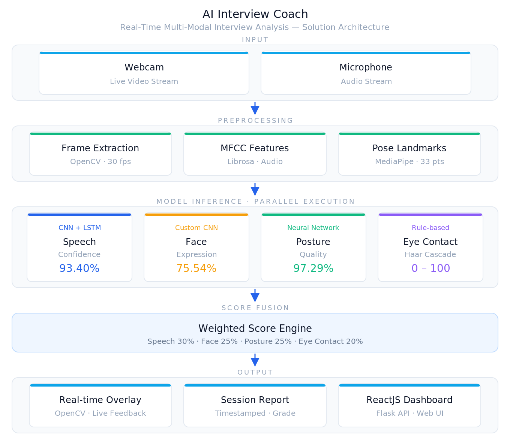
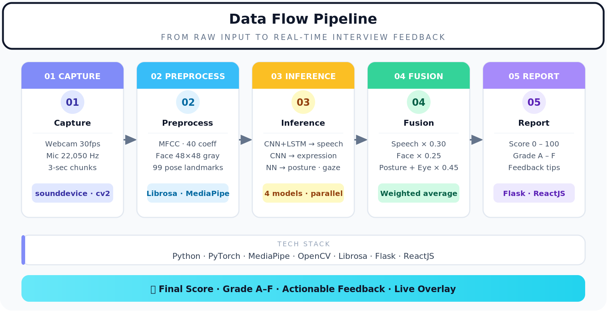

# AI Interview Coach 🎯
<p align="center">
  
  
</p>
> A real-time, multi-modal AI system that analyzes interview performance using four custom-trained deep learning models — evaluating speech confidence, facial expressions, body posture, and eye contact simultaneously.

---

## Overview

AI Interview Coach is a production-level computer vision and machine learning system built entirely from scratch. It processes live webcam and microphone input, runs four independent deep learning models in parallel, and produces a final interview confidence score with actionable feedback — all in real time.

This project demonstrates end-to-end AI engineering: from raw dataset processing and model architecture design, through training and evaluation, to real-time multi-modal inference and deployment.

---

## Demo

> *[Add GIF or screenshot of the live system here]*

---

## System Architecture

```
┌─────────────────────────────────────────────────────────────┐
│                      LIVE INPUT                              │
│              Webcam + Microphone                             │
└───────────────────────┬─────────────────────────────────────┘
                        │
        ┌───────────────┼───────────────┐
        │               │               │               │
        ▼               ▼               ▼               ▼
  ┌──────────┐   ┌──────────┐   ┌──────────┐   ┌──────────┐
  │  AUDIO   │   │  FACE    │   │  POSE    │   │   IRIS   │
  │  MFCC    │   │  CNN     │   │ MediaPipe│   │  Gaze    │
  │ CNN+LSTM │   │ (scratch)│   │    NN    │   │ Geometry │
  └────┬─────┘   └────┬─────┘   └────┬─────┘   └────┬─────┘
       │              │              │               │
       ▼              ▼              ▼               ▼
   Speech(30%)   Face(25%)    Posture(25%)   EyeContact(20%)
        │              │              │               │
        └──────────────┴──────────────┴───────────────┘
                                │
                    ┌───────────▼───────────┐
                    │   Score Fusion Layer   │
                    │   + SHAP Explainability│
                    └───────────┬───────────┘
                                │
                    ┌───────────▼───────────┐
                    │  Final Score (0-100)   │
                    │  Grade + Feedback      │
                    └───────────────────────┘
```

---

## Model Performance

| Model | Dataset | Samples | Architecture | Val Accuracy |
|---|---|---|---|---|
| Speech Confidence | RAVDESS | 2,880 audio files | CNN + LSTM (scratch) | **93.40%** |
| Facial Expression | FER2013 | 28,821 images | Custom CNN (scratch) | **75.54%** |
| Posture Scorer | MultiPosture | 4,794 samples | Neural Network (scratch) | **97.29%** |
| Eye Contact | MediaPipe Face Mesh | — | Geometric inference | Rule-based |

> **Note on Face Model:** 75.54% on FER2013 is a competitive result. FER2013 is widely considered one of the most challenging facial expression datasets — top published papers achieve 65–75% on the same benchmark. Human-level accuracy on FER2013 is approximately 65%.

---

## Key Features

- **4 custom deep learning models** — all architectures designed and trained from scratch, no pretrained weights
- **Real-time multi-modal inference** — all models run simultaneously on live webcam and microphone input
- **Multi-dataset pipeline** — audio (RAVDESS), image (FER2013), and landmark (MultiPosture) datasets processed end-to-end
- **Score fusion layer** — weighted combination of all model outputs into a single interpretable score
- **Actionable feedback** — session report with specific, targeted improvement tips
- **Production-ready structure** — modular codebase, clean separation of data, models, training, and inference

---

## Tech Stack

| Category | Tools |
|---|---|
| Deep Learning | PyTorch |
| Computer Vision | OpenCV, MediaPipe |
| Audio Processing | Librosa, SoundDevice |
| Data Science | NumPy, Pandas, Scikit-learn |
| Visualization | Matplotlib, Seaborn |
| Explainability | SHAP |
| Backend | Flask, Flask-CORS |
| Frontend | ReactJS, TailwindCSS |

---

## Project Structure

```
AI Interview Coach/
├── data/
│   ├── raw/
│   │   ├── ravdess/              ← RAVDESS emotional speech audio
│   │   ├── fer/                  ← FER2013 facial expression images
│   │   └── posture/              ← MultiPosture landmark CSV
│   └── processed/                ← Extracted features
│
├── notebooks/
│   ├── 01_speech_eda.ipynb       ← Audio data exploration & MFCC visualization
│   └── 02_face_eda.ipynb         ← Face image exploration & preprocessing
│
├── src/
│   ├── data/
│   │   ├── audio_processor.py    ← MFCC extraction + augmentation
│   │   ├── face_processor.py     ← Image preprocessing + augmentation
│   │   └── pose_collector.py     ← Posture data collection via webcam
│   ├── models/
│   │   ├── speech_model.py       ← CNN + LSTM architecture
│   │   ├── face_model.py         ← Custom CNN architecture
│   │   ├── posture_model.py      ← Feedforward Neural Network
│   │   └── eye_contact.py        ← Gaze detection via OpenCV
│   ├── training/
│   │   ├── train_speech.py       ← Speech model training script
│   │   ├── train_face.py         ← Face model training script
│   │   └── train_posture.py      ← Posture model training script
│   └── inference/
│       ├── real_time_analyzer.py ← Live webcam + mic pipeline
│       └── score_calculator.py   ← Score fusion + feedback generation
│
├── saved_models/                 ← Trained model weights (not tracked by git)
├── app/
│   ├── backend/app.py            ← Flask REST API
│   └── frontend/                 ← React interface
├── reports/model_metrics/        ← Training curves + accuracy metrics
├── requirements.txt
└── README.md
```

---

## Setup & Reproduction

### Prerequisites
- Python 3.11
- Homebrew (macOS)

### 1. Clone the repository
```bash
git clone https://github.com/AbuBakerAttique/AI-Interview-Coach.git
cd AI-Interview-Coach
```

### 2. Create virtual environment
```bash
python3.11 -m venv venv
source venv/bin/activate
```

### 3. Install dependencies
```bash
pip install -r requirements.txt
pip install mediapipe==0.10.9
```

### 4. Download datasets

| Dataset | Source | Destination |
|---|---|---|
| RAVDESS | [Kaggle](https://www.kaggle.com/datasets/uwrfkaggler/ravdess-emotional-speech-audio) | `data/raw/ravdess/` |
| FER2013 | [Kaggle](https://www.kaggle.com/datasets/jonathanoheix/face-expression-recognition-dataset) | `data/raw/fer/` |
| MultiPosture | [Zenodo](https://zenodo.org/records/14230872) | `data/raw/posture/` |

### 5. Train the models

```bash
# Train posture model (~2 minutes) — Expected: ~97% accuracy
python src/training/train_posture.py

# Train speech confidence model (~10 minutes) — Expected: ~93% accuracy
python src/training/train_speech.py

# Train facial expression model (~15 minutes) — Expected: ~75% accuracy
python src/training/train_face.py
```

### 6. Run the real-time system

```bash
python src/inference/real_time_analyzer.py
```

**Controls:**
- `SPACE` — Start / stop recording session
- `Q` — Quit and print final report

---

## Sample Output

```
==================================================
      INTERVIEW SESSION REPORT
==================================================
  Final Score   : 78.4/100
  Grade         : B
  Duration      : 05:32
--------------------------------------------------
  Speech        : 82.1/100
  Face          : 74.3/100
  Posture       : 91.0/100
  Eye Contact   : 63.8/100
--------------------------------------------------
  Feedback:
  • Great speech confidence! Your tone was strong and clear.
  • Maintain more eye contact with the camera.
==================================================
```

---

## Author

**Abubaker Attique**
BSc Computer Science — NUCES FAST, Islamabad, Pakistan
MSc Artificial Intelligence — BTU Cottbus-Senftenberg, Germany

[LinkedIn](https://www.linkedin.com/in/abubakerattique/) | [GitHub](https://github.com/AbuBakerAttique) | Abubakerokz@gmail.com
